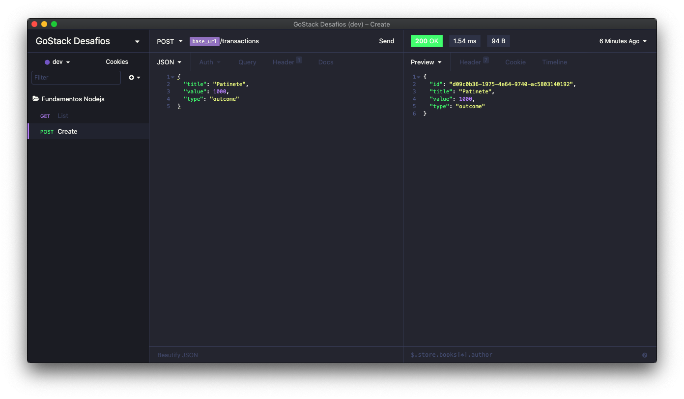
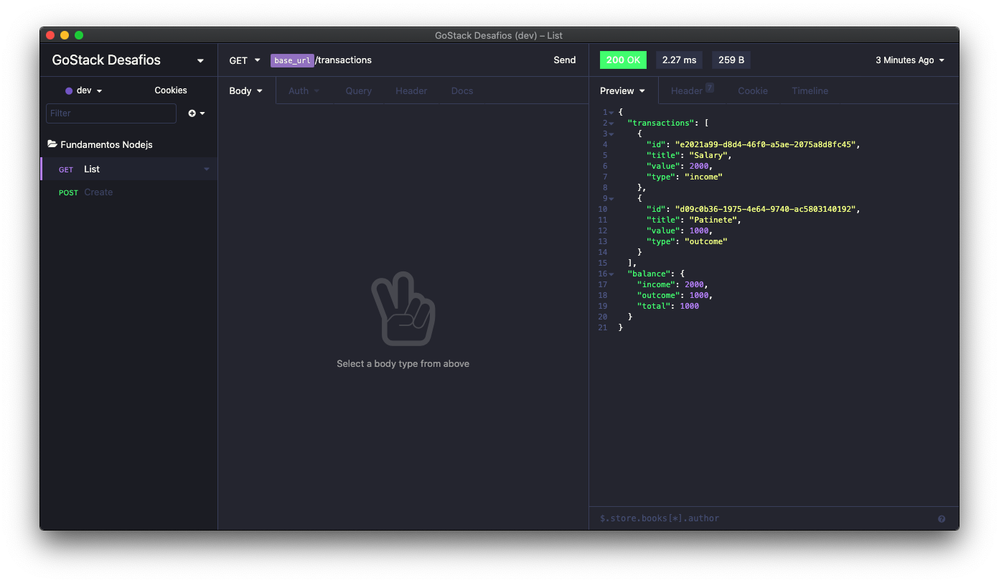

<h3 align="center">
  Challenge 05: First project Node.js
</h3>

<p align="center">
  
</p>

### 🚀 About the challenge

In this challenge, you must create an application to continue training what you have learned so far in Node.js with TypeScript, using the concept of models, repositories and services!

This will be an application to store incoming and outgoing financial transactions, which should allow the registration and listing of these transactions.

### ➡️ Application Routes

- **`POST /transactions`**: The route must receive title, value and type within the body of the request, type is the type of the transaction, which must be income for inflows (deposits) and outcome for outflows (withdrawals). When registering a new transaction, it must be stored inside an object with the following format:
```json
{
  "id": "uuid",
  "title": "Salário",
  "value": 3000,
  "type": "income"
}
```

- **`GET /transactions`**: This route should return a listing with all the transactions you have registered so far, together with the sum of the entries, withdrawals and total credit. This route must return an object with the following format:
```json
{
  "transactions": [
    {
      "id": "uuid",
      "title": "Salário",
      "value": 4000,
      "type": "income"
    },
    {
      "id": "uuid",
      "title": "Freela",
      "value": 2000,
      "type": "income"
    },
    {
      "id": "uuid",
      "title": "Pagamento da fatura",
      "value": 4000,
      "type": "outcome"
    },
    {
      "id": "uuid",
      "title": "Cadeira Gamer",
      "value": 1200,
      "type": "outcome"
    }
  ],
  "balance": {
    "income": 6000,
    "outcome": 5200,
    "total": 800
  }
}
```


<strong>Insomnia App was used to test endpoints</strong><br>




<a target="_blank" href=".github/insomnia_fundamentos-nodejs.json">Download Insomnia Endpoints JSON</a>


### Tests Specification

- **`should be able to create a new transaction`**: For this test to pass, your application must allow a transaction to be created, and return a json with the created transaction.

- **`should be able to list the transactions`**: For this test to pass, your application must allow an object to be returned containing all transactions along with the balance of income, outcome and total transactions that have been created so far.

- **`should not be able to create outcome transaction without a valid balance`**: For this test to pass, your application must not allow a transaction of the outcome type to exceed the total amount that the user has in the box, returning a response with HTTP 400 code and an error message in the following format: ````{ error: string }````

---

Made with ❤️ by morikawa77
